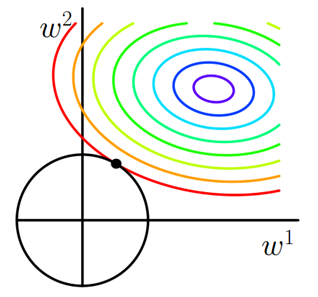

# 正则化
L1正则化和L2正则化的直观解释：即带约束的优化问题。

考虑一个优化目标：
    
$$\min_J J = loss + ||w||_2$$

则该优化目标可看作是对 $loss$的优化，带上一个约束 $||w||_2$.

## L1正则化
$||w||_1 = \sum_w{|w|}$ 即参数的绝对值之和。如下图，可看作loss函数在L1正则项的约束下的优化。约束下的最优值一般在顶点上，即坐标轴上，故参数的值更有可能为0，故会使得参数矩阵稀疏，适合做特征选择。

## L2正则化
$||w||_2 = \sqrt{\sum_w{w^2}}$ 即参数的平方和开根号.如下图，可看作loss函数在L2正则项的约束下的优化。

## 总结
由上面两图可见，在使用正则项时，优化函数都会被往原点方向约束， $\lambda$越大，正方形/圆形越小，越接近远点。
