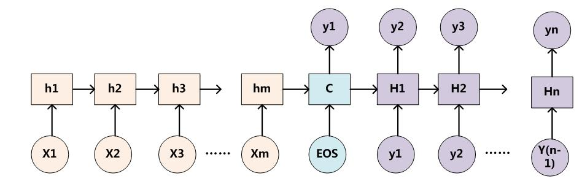

# 注意力机制
##### 以机器翻译为例
## 传统的机器翻译框架：Encoder-Decoder

其中Encoder和Decoder一般分别为单个RNN网络。通过一个Encoder将输入的句子转化为中间语义C。再通过一个Decoder，根据语义C和之前已经生成的历史信息$y_1,y_2,...,y_{i-1}$来生成i时刻要生成的单词$y_i$.

### 缺点
Encoder将输入句子X的信息编码成一个C，后续解码时，无论要生成哪个单词，这个待生成的单词对X中每个单词的依赖都是相同的。如果输入句子比较长，此时所有语义完全通过一个中间语义向量来表示，单词自身的信息已经消失，可想而知会丢失很多细节信息，这也是为何要引入注意力模型的重要原因。

## 引入注意力机制的encoder-decoder框架

其中$C_i = \sum_{j=1}^{T_x}\alpha^{\langle i,j\rangle}*a^j$,  $a^j$表示encoder中第i个单词对应的输出，$\alpha^{i,j}$表示在生成第i个词时，关于第j个输入的注意力。

那么$\alpha^{i,j}$应该怎么计算呢？

$$\alpha^{i,j} = \frac{exp(e^{<i,j>})}{\sum_{j=1}^{T_x}exp(e^{<i,j>})}$$

$e^{<i,j>}$的计算方法如下：其中$s^{<t-1>}$表示decoder中上一step的隐藏层状态。

decoder可表示为$y^i=g(y^{t-1}, C_i)$，即上一step得到的词和该step的注意力$C_i$作为输入，来得到$y^i$，如下图所示：

