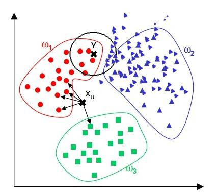
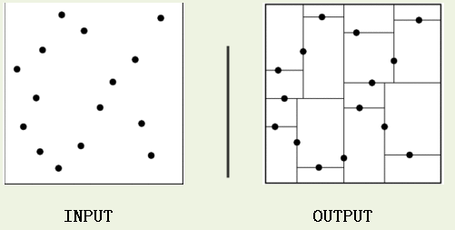

# KNN
## knn存在的问题
### 1. 样本不平衡的问题
当样本不平衡时，即不同类别的样本数量相差很大，则对于处在分类边界的点，使用knn时，选中的topK中，大样本占比会很较多，导致分类不准确。比如下图的Y点，虽然离红色区更近，但是因为在红蓝交界，且蓝色样本更密集，故knn的结果会将其分到蓝色点。

我们可以采用权值的方法来改进。和该样本距离小的邻居权值大，和该样本距离大的邻居权值则相对较小，由此，将距离远近的因素也考虑在内，避免因一个样本过大导致误判的情况。

或者，如果某类的样本少，那么knn投票时，该样本的比重就大，样本多，则k个样本中这一类的权重就小。比如二分类，其中30%属于第一类，70%属于第二类，则knn时，k个近邻中，若某近邻属于第一类，则其权重为0.7，若属于第二类，则其权重为0.3。

### 2. 大数据集的搜索效率
当数据集很大时，再适用knn搜索topK，效率会很低。改进方法：_kd-tree_

## _kd-tree_ ——kd树
_kd-tree_: 表示 _k-dimension tree_ ，是一种二叉树结构，注意此处的 _k_ 表示维度，而不是 _knn_ 中的 _k_。

kd树(K-dimension tree)是一种对k维空间中的实例点进行存储以便对其进行快速检索的树形数据结构。kd树是是一种二叉树，表示对k维空间的一个划分，构造kd树相当于不断地用垂直于坐标轴的超平面将K维空间切分，构成一系列的K维超矩形区域。kd树的每个结点对应于一个k维超矩形区域。如下图

KD树中每个节点是一个向量，和二叉树按照数的大小划分不同的是，KD树每层需要选定向量中的某一维，然后根据这一维按左小右大的方式划分数据。在构建KD树时，关键需要解决2个问题：（1）选择向量的哪一维进行划分；（2）如何划分数据。第一个问题简单的解决方法可以是选择随机选择某一维或按顺序选择，但是更好的方法应该是在数据比较分散的那一维进行划分（分散的程度可以根据方差来衡量）。好的划分方法可以使构建的树比较平衡，可以每次选择中位数来进行划分。

### 构造平衡kd树的算法：
* 输入： k维空间数据集$T=\{x_1, x_2, ..., x_N\}$, 其中$x_i = (x_i^1, x_i^2, ..., x_i^k)^T$
* 输出: kd树
1. 构造根结点，根结点对应于包含T的k维空间的超矩形区域。选择 $x^1$ 为坐标轴，以T中所有实例的 $x^1$ 坐标的中位数为切分点，将根结点对应的超矩形区域切分为两个子区域。切分由通过切分点并与坐标轴 $x^1$ 垂直的超平面实现。由根结点生成深度为1的左、右子结点：左子结点对应坐标 $x^1$ 小于切分点的子区域，右子结点对应于坐标 $x^1$ 大于切分点的子区域。将落在切分超平面上的实例点保存在根结点。
2. 重复。对深度为 _j_ 的结点，选择 $x^l$ 为切分的坐标轴，$l=j\mod (k+1)$，以该结点的区域中所有实例的 $x^l$ 坐标的中位数为切分点，将该结点对应的超矩形区域切分为两个子区域。切分由通过切分点并与坐标轴 $x^l$ 垂直的超平面实现。

    由该结点生成深度为 _j+1_ 的左、右子结点：左子结点对应坐标 $x^l$ 小于切分点的子区域，右子结点对应坐标 $x^l$ 大于切分点的子区域。将落在切分超平面上的实例点保存在该结点。

