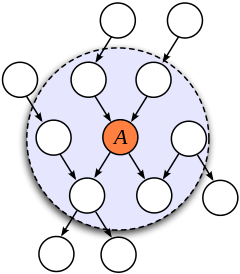

# 变分推断

大家对贝叶斯公式应该都很熟悉

$$P(Z|X)=\frac{p(X,Z)}{\int_z p(X,Z=z)dz}$$

我们称$P(Z|X)$为`posterior distribution`。`posterior distribution`的计算通常是非常困难的，为什么呢？
假设$Z$是一个高维的随机变量，如果要求$P(Z=z|X=x)$,我们不可避免的要计算$\int_z p(X=x,Z=z)dz$,由于$Z$是高维随机变量，这个积分是相当难算的。

**`variational inference`就是用来计算`posterior distribution`的。**

## core idea
`variational inference`的核心思想包含两步：

- 假设分布$q(z;\lambda)$   (这个分布是我们搞得定的，搞不定的就没意义了)
- 通过改变分布的参数 $\lambda$ , 使 $q(z;\lambda)$ 靠近 $p(z|x)$

总结称一句话就是，**为真实的后验分布引入了一个参数话的模型**。 即：用一个简单的分布  $q(z;\lambda)$  拟合复杂的分布  $p(z|x)$ 。

这种策略将计算 $p(z|x)$ 的问题转化成优化问题了

$$
\lambda^* = \arg\min_{\lambda}~divergence(p(z|x),q(z;\lambda))
$$

收敛后，就可以用 $q(z;\lambda)$ 来代替 $p(z|x)$了

## 公式推倒

$$
\begin{aligned}
\text{log}P(x) &= \text{log}P(x,z)-\text{log}P(z|x) \\
&=\text{log}\frac{P(x,z)}{Q(z;\lambda)}-\text{log}\frac{P(z|x)}{Q(z;\lambda)}
\end{aligned}
$$

等式的两边同时对分布$Q(z)$求期望，得

$$
\begin{aligned}
\mathbb E_{q(z;\lambda)}\text{log}P(x) &= \mathbb E_{q(z;\lambda)}\text{log}P(x,z)-\mathbb E_{q(z;\lambda)}\text{log}P(z|x), \\
\text{log}P(x)&=\mathbb E_{q(z;\lambda)}\text{log}\frac{p(x,z)}{q(z;\lambda)}-\mathbb E_{q(z;\lambda)}\text{log}\frac{p(z|x)}{q(z;\lambda)}, \\
&=KL(q(z;\lambda)||p(z|x))+\mathbb E_{q(z;\lambda)}\text{log}\frac{p(x,z)}{q(z;\lambda)},\\
\text{log}P(x)&=KL(q(z;\lambda)||p(z|x))+\mathbb E_{q(z;\lambda)}\text{log}\frac{p(x,z)}{q(z;\lambda)},
\end{aligned}
$$

我们的目标是使 $q(z:\lambda)$ 靠近 $p(z|x)$ ,就是$\min_\lambda KL(q(z;\lambda)||p(z|x))$ ,由于 $KL(q(z;\lambda)||p(z|x))$ 中包含 $p(z|x)$ ，这项非常难求。将$\lambda$看做变量时，$\text{log}P(x)$ 为常量，所以， $\min_\lambda KL(q(z;\lambda)||p(z|x))$ 等价于 $\max_\lambda \mathbb E_{q(z;\lambda)}\text{log}\frac{p(x,z)}{q(z;\lambda)}$。 $\mathbb E_{q(z;\lambda)}[\text{log}p(x,z)-\text{log}q(z;\lambda)]$ 称为Evidence Lower Bound(`ELBO`)。

现在，`variational inference`的目标变成

$$\max_\lambda \mathbb E_{q(z;\lambda)}[\text{log}p(x,z)-\text{log}q(z;\lambda)]$$

为什么称之为`ELBO`呢？
$p(x)$一般被称之为`evidence`，又因为 $KL(q||p)>=0$, 所以  $p(x)>=E_{q(z;\lambda)}[\text{log}p(x,z)-\text{log}q(z;\lambda)]$, 这就是为什么被称为`ELBO`

## ELBO
继续看一下ELBO

$$
\begin{aligned}
ELBO(\lambda) &= \mathbb E_{q(z;\lambda)}[\text{log}p(x,z)-\text{log}q(z;\lambda)] \\
&= \mathbb E_{q(z;\lambda)}\text{log}p(x,z) -\mathbb E_{q(z;\lambda)}\text{log}q(z;\lambda)\\
&= \mathbb E_{q(z;\lambda)}\text{log}p(x,z) + H(q)
\end{aligned}
$$

The first term represents an energy. The energy encourages $q$ to focus probability mass where the model puts high probability, $p(\mathbf{x}, \mathbf{z})$. The entropy encourages $q$ to spread probability mass to avoid concentrating to one location.

## $q(Z)$
$Z$包含K个独立部分(K维， 当然，第i维也可能是高维向量)，我们假设：

$$
q(Z;\lambda) = \prod_{k=1}^{K}q_k(Z_k;\lambda_k)
$$

这个被称为`mean field approximation`。关于`mean field approximation`，[https://metacademy.org/graphs/concepts/mean_field](https://metacademy.org/graphs/concepts/mean_field)
`ELBO`则变成

$$
\begin{aligned}
ELBO(\lambda) &= \mathbb E_{q(Z;\lambda)}\text{log}p(X,Z) -\mathbb E_{q(z;\lambda)}\text{log}q(Z;\lambda) \\
&= \int q(Z;\lambda)\text{log}p(X,Z)dZ-\int q(Z;\lambda)\text{log}q(Z;\lambda)dZ\\
&=\int [\prod_{k=1}^{K}q_k(Z_k;\lambda_k)] \text{log}p(X,Z)dZ-\int [\prod_{k=1}^{K}q_k(Z_k;\lambda_k)] \text{log}q(Z;\lambda)dZ
\end{aligned}
$$
第一项为 `energy`， 第二项为`H(q)`
## energy
符号的含义：

$$Z = \{Z_j,\overline Z_j \}, \overline Z_j=Z\backslash Z_j$$

$$\lambda=\{\lambda_j, \overline\lambda_j\}, \overline \lambda_j=\lambda\backslash\lambda_j$$

先处理第一项：

$$
\begin{aligned}
&\int \Bigr[\prod_{k=1}^{K}q_k(Z_k;\lambda_k)\Bigr] \text{log}p(X,Z)dZ = \\
&\int_{Z_j}q_j(Z_j;\lambda_j)\int_{ \overline Z_j}\Bigr[\prod_{k=1,k\neq j}^K q_k(Z_k;\lambda_k)\Bigr]\text{log}p(X,Z)d \overline Z_jdZ_j = \\
&\int_{Z_j}q_j(Z_j;\lambda_j)\Bigr[E_{q(\overline Z_j;\overline \lambda_j)}\text{log}p(X,Z)\Bigr]dZ_j=\\
&\int_{Z_j}q_j(Z_j;\lambda_j)\{\log \exp\Bigr[E_{q(\overline Z_j;\overline \lambda_j)}\text{log}p(X,Z)\Bigr]\}dZ_j=\\
&\int_{Z_j}q_j(Z_j;\lambda_j)\Bigr[\log q_j^* (Z_j;\lambda_j)+\log C\Bigr]dZ_j
\end{aligned}
$$

其中

$$q_j^* (Z_j;\lambda_j)=\frac{1}{C}\exp[E_{q(\overline Z_j;\overline \lambda_j)}\text{log}p(X,Z)]$$,
$C$ 保证 $q_j^* (Z_j;\lambda_j)$ 是一个分布。$C$ 与分布的参数 $\overline \lambda_j$ 有关，与变量无关！！

## H(q)
再处理第二项：

$$
\begin{aligned}
&\int \Bigr[\prod_{k=1}^{K}q_k(Z_k;\lambda_k)\Bigr] \text{log}q(Z;\lambda)dZ = \\
&\int \Bigr[\prod_{k=1}^{K}q_k(Z_k;\lambda_k)\Bigr] \sum_{n=1}^K\text{log}q(Z_n;\lambda)dZ = \\
&\sum_j\int \Bigr[\prod_{k=1}^{K}q_k(Z_k;\lambda_k)\Bigr]  \text{log}q(Z_j;\lambda_j)dZ=\\
&\sum_j\int \Bigr[\prod_{k=1}^{K}q_k(Z_k;\lambda_k)\Bigr]  \text{log}q(Z_j;\lambda_j)dZ=\\
&\sum_j\int_{Z_j} q_j(Z_j;\lambda_j)\text{log}q(Z_j;\lambda_j)dZ_j\int [\prod_{k=1,k\neq j}^{K}q_k(Z_k;\lambda_k)]d\overline Z_j=\\
&\sum_j\int_{Z_j} q_j(Z_j;\lambda_j)\text{log}q(Z_j;\lambda_j)dZ_j
\end{aligned}
$$

## 再看ELBO
经过上面的处理，ELBO变为

$$
\begin{aligned}
ELBO &= \int_{Z_i}q_i(Z_i;\lambda_j)\text{log}q_i^* (Z_i;\lambda_i)dZ_i-\sum_j\int_{Z_j} q_j(Z_j;\lambda_j)\text{log}q(Z_j;\lambda_j)dZ_j+\log C\\
&=\{\int_{Z_i}q_i(Z_i;\lambda_j)\text{log}q_i^* (Z_i;\lambda_i)dZ_i-\int_{Z_i} q_i(Z_i;\lambda_j)\text{log}q(Z_i;\lambda_i)dZ_i\} +H(q(\overline Z_i;\overline \lambda_i))+\log C\\
&
\end{aligned}
$$

再看上式 $\{\}$ 中的项：

$$
\int_{Z_i}q_i(Z_i;\lambda_j)\text{log}q_i^* (Z_i;\lambda_i)dZ_i-\int_{Z_i} q_i(Z_i;\lambda_j)\text{log}q(Z_i;\lambda_i)dZ_i = -KL(q_i(Z_i;\lambda_j)||q_i^* (Z_i;\lambda_i))
$$

所以ELBO又可以写成：

$$
ELBO=-KL(q_i(Z_i;\lambda_j)||q_i^* (Z_i;\lambda_i))+H(q(\overline Z_i;\overline \lambda_i))+\log C
$$

我们要$maxmize ELBO$，如何更新 $q_i(Z_i;\lambda_i)$ 呢？
从

$$
ELBO=-KL(q_i(Z_i;\lambda_i)||q_i^* (Z_i;\lambda_i))+H(q(\overline Z_i;\overline \lambda_i))+\log C
$$

可以看出，当 $q_i(Z_i;\lambda_j)=q_i^* (Z_i;\lambda_i)$ 时， $KL(q_i(Z_i;\lambda_j)||q_i^* (Z_i;\lambda_i))=0$ 。 这时，ELBO取最大值。
所以参数更新策略就变成了

$$
\begin{aligned}
&q_1(Z_1;\lambda_1)=q_1^* (Z_1;\lambda_1)\\
&q_2(Z_2;\lambda_2)=q_2^* (Z_2;\lambda_2)\\
&q_3(Z_3;\lambda_3)=q_3^* (Z_3;\lambda_3)\\
&...
\end{aligned}
$$

关于 $q_i^* (Z_i;\lambda_i)$

$$
\begin{aligned}
q_i(Z_i;\lambda_i)&=q_i^* (Z_i;\lambda_i)\\
q_i (Z_i;\lambda_i)&=\frac{1}{C}\exp[E_{q(\overline Z_i;\overline \lambda_i)}\text{log}p(X,Z)]\\
&=\frac{1}{C}\exp[E_{q(\overline Z_i;\overline \lambda_i)}\text{log}p(X,Z_i,\overline Z_i)]\\
&
\end{aligned}
$$

$q_i$ 是要更新的节点，$X$ 是观测的数据,由于 `Markov Blanket`(下面介绍)，更新公式变成：

$$
\log(q_i(Z_i;\lambda_i))=\int q(mb(Z_i))\log p(Z_i,mb(Z_i),X)d~mb(Z_i)
$$

由于式子中和 $Z_i$ 无关的项都被积分积掉了，所以写成了 `Markov Blanket` 这种形式
## Markov Blanket
In machine learning, the Markov blanket for a node $A$ in a Bayesian network is the set of nodes $mb(A)$ composed of $A's$ parents, its children, and its children's other parents. In a Markov random field, the Markov blanket of a node is its set of neighboring nodes.
Every set of nodes in the network is conditionally independent of $A$ when conditioned on the set $mb(A)$, that is, when conditioned on the Markov blanket of the node $A$ . The probability has the Markov property; formally, for distinct nodes $A$ and $B$:

$$
Pr(A|mb(A),B)=Pr(A|mb(A))
$$

The Markov blanket of a node contains all the variables that shield the node from the rest of the network. **This means that the Markov blanket of a node is the only knowledge needed to predict the behavior of that node.**

## 参考资料
[https://en.wikipedia.org/wiki/Markov_blanket](https://en.wikipedia.org/wiki/Markov_blanket)

[http://edwardlib.org/tutorials/inference](http://edwardlib.org/tutorials/inference)

[http://edwardlib.org/tutorials/variational-inference](http://edwardlib.org/tutorials/variational-inference)
